# Vehicle Detection Project

The aim of this project is to detect the vehicles in images using histogram of oriented gradients (HOG features). The steps of the project are:

* Extracting the HOG features from vehcile and non-vehicle images for different parameters and color spaces to perform a feature exploration.

* Contructing sub-datasets to explore the best perfoming HOG features using support vectore machines.

* Selecting the best features and the support vectore machine model to train on the full dataset.

* False positive mining to augment the dataset and training the best model again.

* Implementing sliding window technique.

* Running the pipeline on the project video to generate heat maps.

* Implementing bounding box aggregation using generated heat maps to estimate the vehicle locations.

## HOG Features

When the class of objects varies in color, structural features like gradients or edges might give a more robost representation. This way, different signatures for different shapes can be obtained. However, the signature for a shape should have enough flexibility to accommodate small variations in orientation, size, etc. The problem with using the gradient values directly is that the signature becomes too sensitive. To allow some variability the histogram of oriented gradients (HOG), which is a more flexible approach, will be implemented.

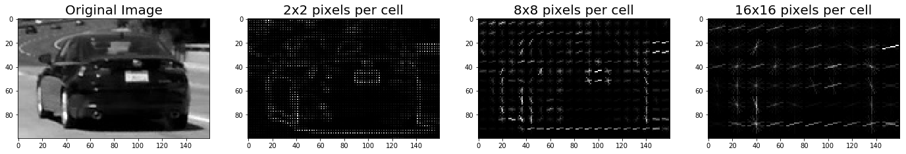

Representations of the HOG features of a car with different cell sizes.  

In order to get the HOG features, a helper function named `get_hog` is [implemented](./feature-extraction.ipynb) using the [scikit-image](http://scikit-image.org/) package to compute the histogram of gradient directions (orientations) of an image. The gradient samples are distributed into a nine orientation bins as default. Nine bins were enough for the accuracy in small scales. Here in the implementation of the histogram, it is not used just the count of the samples in each direction. Instead, the gradient magnitudes of each sample are summed up. This way, the stronger gradients contribute more weight to their orientation bin and thus, the effect of noise is reduced. By dividing the images into different size of cells (e.g. 2x2, 8x8 and 16x16) and by getting the histogram for the directions and the gradient magnitudes of the pixels in these cells, the representations of the structures emerge. The main advantage is that HOG gives the ability to accept small variations in the shape, while keeping the signature distinct enough. The sensitivity for the features can be tweaked by varying parameters such as the number of orientation bins, grid of cells, cell sizes, the overlap between cells, block normalization, etc ([Navneet Dalal and Bill Triggs, 2005](http://ieeexplore.ieee.org/document/1467360/)).

## The Dataset

The dataset provided for the project is a combination of datasets from various sources. These sources are [GTI vehicle image database](http://www.gti.ssr.upm.es/data/Vehicle_database.html) (GTI), [KITTI vision benchmark suite](http://www.cvlibs.net/datasets/kitti/) and extra images extracted from [Udacity](https://www.udacity.com/)'s [project video](./project_video.mp4). The dataset has two classes of images (all have a size of 64x64 pixels) with the labels *vehicle* and *non-vehicle*. The number of images with the *vehicle* label and their sources are shown below. The sets of *GTI Far*, *GTI left*, *GTI Right* and *GTI MidClose* are from the same source of GTI with different viewpoints. Together with the *KITTI* examples they constitute the whole set of *vehicle* images.

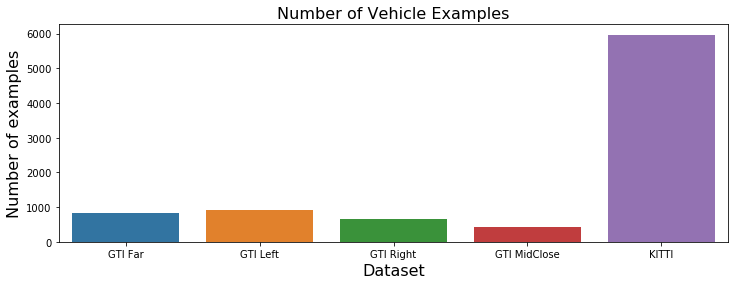

Some of the examples from *vehicle* sources are given below.

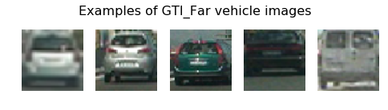

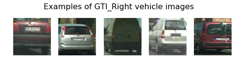

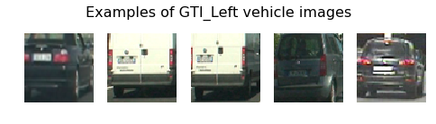

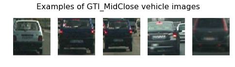

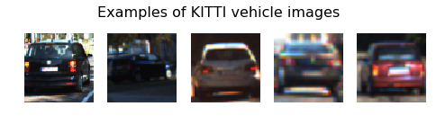

The *non-vehicle* images are taken from GTI along with extra captured images from the project video. The number of examples for each source is given below.

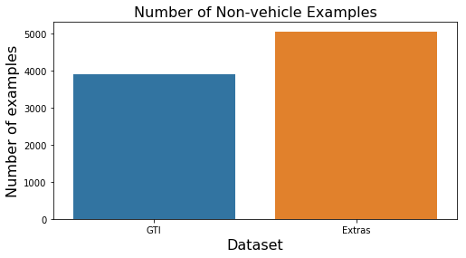

And some of the examples from *non-vehicle* sources are given below.

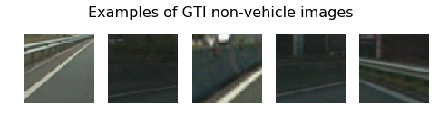

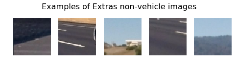

In order to check the balance between *vehicle* and *non-vehicle* classes the total number of examples for each class is given below.

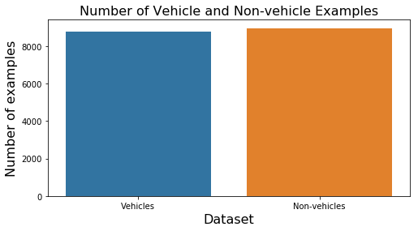

As can be seen from the figure, the classes of the dataset seem to be roughly balanced, thus no augmentation will be applied for balancing.

## Support Vector Machines

Support vector machine model is chosen as the classifier for the project.

Support vector machines are discriminative classfiers separating the classes by a hyperplane and they are very effective by using a maximum margin separation. A representation of a margin with a maximum possible value of a SVM is given below. The two different colors of dots represent the classes and the separation by the margin is represented with the dashed lines.

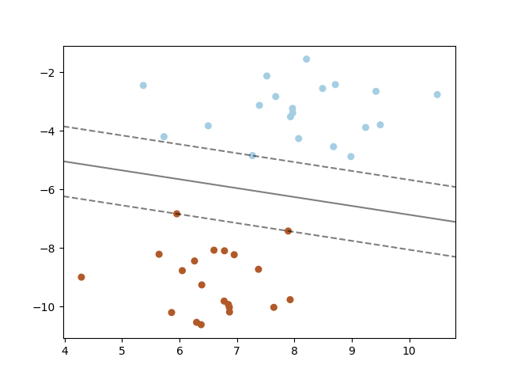

Credits [scikit-learn](http://scikit-learn.org/stable/modules/svm.html).

It is possible to use different kernel functions as a decision function with SVMs. Different kernels can be specified for different tasks and it is easy to implement a kernel with SVMs using opensource libraries like [scikit-learn](http://scikit-learn.org). SVMs with linear kernels works faster, however for better accurasies a non-linear kernel (RBF) is chosen for the project.

For the implementation of the SVM with RBF kernels, the open library [scikit-learn](http://scikit-learn.org/stable/modules/svm.html) is used. For an RBF kernel there are two major parameters which are the penalty parameter (`C`) and the kernel coefficient (`gamma`). These paramters should be tuned for better accuracies and thus `GridSearchCV` function of scikit-learn library is used for a parameter exploration. `GridSearchCV` function takes a list of parameters and performs a cross-validation for all the combinations, then returns the best parameters for the result with the highest accuracy.

## Feature Exploration

There are several ways to extract the HOG features. Most important feature extracting parameters are pixels per cell (`pix_per_cell`), cells per block (`cell_per_block`) and the number of orientation bins (`orient`). `pix_per_cell` defines the number of pixels in a cell, in each cell the gradient orientations are computed and the directions are grouped into orientation bins (the number of bins is controlled by the parameter `orient`). These gradient orientations are distributed into nine orientation bins as default. Nine bins were enough for the accuracy in small scales ([Navneet Dalal and Bill Triggs, 2005](http://ieeexplore.ieee.org/document/1467360/)). However, the best parameters for the pixel number in each cell and the cell number per block depend on the objects and shapes in a dataset. For instance, choosing larger cell sizes increases the magnitudes with a decrease in the resolution of the HOG representations, however, larger cell sizes may give better results depending on the shapes in the images. In addition, a block of cells (defined as `cell_per_block`) is chosen for the block normalization and reduces the effects of the lighting variations on images. However, choosing larger block sizes does not guarantee better results. For instance, it is reported that for human detection features, choosing the block sizes as wide as the human limbs performs best ([Navneet Dalal and Bill Triggs, 2005](http://ieeexplore.ieee.org/document/1467360/)). Thus, these parameters heavily depend on the shape sizes in a specific dataset and need exploration. To find the best parameters, various sub-datasets (datasets with smaller number of examples are chosen for to reduce the training time) of different parameters are [prepared](./feature-extraction.ipynb). Since it is important to keep a balance between the accuracy and the computational load, the size of cells and the blocks are chosen in a limited range (small cells and large blocks are computationally expensive). A table is given below for the [explored](./feature-exploration.ipynb) sub-datasets with various features extracted from RGB, GRAY and HSV color spaces. Support vector machine models are used for training by implementing a grid search (using `GridSearchCV` library) for tuning the model parameters. Only the best accuracy results with the best model parameters are given in the table. For the results below, only the SVMs with the RBF kernels are listed. SVMs with linear kernels train faster, however [perform poorly](./feature-exploration-linear-svm.ipynb).

| No      | Color space   | Hist eqz* | Pixels per cell | Cells per block | Bins | Size**   | Test accuracy |
|:-------:|:-------------:|:---------:|:---------------:|:---------------:|:----:|:--------:|---------:|
| 1       | GRAY          | Yes       | 8x8             | 1x1             | 9    | 4000     | 0.951    |
| 2       | GRAY          | No        | 8x8             | 1x1             | 9    | 4000     | 0.927    |
| 3       | GRAY          | Yes       | 8x8             | 2x2             | 9    | 4000     | 0.977    |
| 4       | GRAY          | No        | 8x8             | 2x2             | 9    | 4000     | 0.952    |
| 5       | GRAY          | Yes       | 16x16           | 1x1             | 9    | 4000     | 0.968    |
| 6       | GRAY          | No        | 16x16           | 1x1             | 9    | 4000     | 0.956    |
| **7**   | **GRAY**      | **Yes**   | **16x16**       | **2x2**         | **9**| **4000** | **0.984**|
| 8       | GRAY          | No        | 16x16           | 2x2             | 9    | 4000     | 0.975    |
| 9       | RGB           | Yes       | 8x8             | 1x1             | 9    | 4000     | 0.961    |
| 10      | RGB           | No        | 8x8             | 1x1             | 9    | 4000     | 0.935    |
| 11      | RGB           | Yes       | 8x8             | 2x2             | 9    | 4000     | 0.983    |
| 12      | RGB           | No        | 8x8             | 2x2             | 9    | 4000     | 0.963    |
| 13      | RGB           | Yes       | 16x16           | 1x1             | 9    | 4000     | 0.971    |
| 14      | RGB           | No        | 16x16           | 1x1             | 9    | 4000     | 0.955    |
| **15**  | **RGB**       | **Yes**   | **16x16**       | **2x2**         | **9**| **4000** | **0.989**|
| 16      | RGB           | No        | 16x16           | 2x2             | 9    | 4000     | 0.977    |
| 17      | HSV           | Yes       | 8x8             | 1x1             | 9    | 4000     | 0.946    |
| 18      | HSV           | No        | 8x8             | 1x1             | 9    | 4000     | 0.961    |
| 19      | HSV           | Yes       | 8x8             | 2x2             | 9    | 4000     | 0.966    |
| 20      | HSV           | No        | 8x8             | 2x2             | 9    | 4000     | 0.972    |
| 21      | HSV           | Yes       | 16x16           | 1x1             | 9    | 4000     | 0.967    |
| 22      | HSV           | No        | 16x16           | 1x1             | 9    | 4000     | 0.966    |
| 23      | HSV           | Yes       | 16x16           | 2x2             | 9    | 4000     | 0.976    |
| 24      | HSV           | No        | 16x16           | 2x2             | 9    | 4000     | 0.980    |

\* Hist eqz: Histogram equalization is applied or not.
\*\* Size: total number of examples in a dataset. All of the sub-datasets have 2000 vehicle examples and 2000 non-vehicle examples.

As can be seen from the table, histogram equalization is an important factor for higher accuracies and features of 16x16 cell sizes and 2x2 blocks perform best in GRAY and RGB color spaces. For GRAY and RGB color spaces, the two best performing features can be seen in bold characters from the above table. For these best performing two datasets, a further [exploration](./feature-exploration.ipynb#Further-exploration) with larger block sizes are also performed and the test accuracy of each dataset is given in the table below.

| No      | Color space   | Hist eqz  | Pixels per cell | Cells per block | Bins | Size   | Test accuracy |
|:-------:|:-------------:|:---------:|:---------------:|:---------------:|:----:|:--------:|---------:|
| 1       | GRAY          | Yes       | 16x16           | 3x3             | 9    | 4000     | 0.977    |
| 2       | GRAY          | No        | 16x16           | 3x3             | 9    | 4000     | 0.980    |
| 3       | GRAY          | Yes       | 16x16           | 4x4             | 9    | 4000     | 0.983    |
| 4       | GRAY          | No        | 16x16           | 4x4             | 9    | 4000     | 0.983    |
| 5       | RGB           | Yes       | 16x16           | 3x3             | 9    | 4000     | 0.986    |
| 6       | RGB           | No        | 16x16           | 3x3             | 9    | 4000     | 0.977    |
| 7       | RGB           | Yes       | 16x16           | 4x4             | 9    | 4000     | 0.984    |
| 8       | RGB           | No        | 16x16           | 4x4             | 9    | 4000     | 0.983    |

No dramatic increace in accuracies is observed for block sizes of 3x3 and 4x4. Since increasing the block size is an expensive operation, only the best performing two datasets of 2x2 block sizes (highlighted in bold characters in the first table) are chosen and explored on the datasets of full sizes, then the features of the best performing dataset is chosen to be the final dataset for the project.

### Final features and the training

The features of two best performing sub-datasets (which are highlighted in bold characters in the first table) are extracted for a final test. This time, same features are extracted for all of the examples. In addition, without applying the histogram eqaulizations, four datasets in total are tested as the final step of the feature exploration. These datasets and the feature parameters are given below.

| Dataset Name | Color space   | Hist eqz  | Pixels per cell | Cells per block | Bins | Size     |
|:------------:|:-------------:|:---------:|:---------------:|:---------------:|:----:|:--------:|
| dataset 1    | GRAY          | Yes       | 16x16           | 2x2             | 9    | 17760    |
| dataset 2    | GRAY          | No        | 16x16           | 2x2             | 9    | 17760    |
| dataset 3    | RGB           | Yes       | 16x16           | 2x2             | 9    | 17760    |
| dataset 4    | RGB           | No        | 16x16           | 2x2             | 9    | 17760    |

Only the best performing features (features of dataset 3) are chosen as the features used for the project. The test accuracies for these datasets are given below.

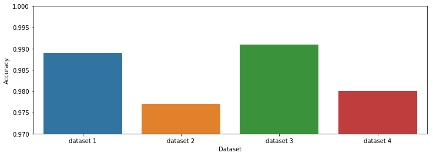

As can be seen from the figure, dataset 3 performs best (%0.991 test accuracy). As a result, dataset 3 features are [used for training](./train-model-with-best-dataset.ipynb) by using the SVM model with the best model parameters, then this final model is used to detect vehicles in the video stream of the project.

## Detecting Vehicles with a Sliding Windows Search

In order to detect the vehicles, a sliding windows approach is used. All the detection pipeline is implemented in a single function named [find_cars](./results-with-the-best-model.ipynb#Car-detection-function). In order to reduce the computation time, a region of interest is defined where the cars appear in the image, and the hog features of this region are computed at once. Then this features are separated into small feature images of size defined by a scale factor. If the scale factor is set to 1., the search window size becomes the default size which is 64x64 pixels (4x4 cells in each example with 16x16 pixel cell size). For instance, if the scale factor chosen to be 1.5, then the search window size becomes 96x96 pixels. Below some detection results are given for various scale factors (1.0, 1.3, 1.5, 1.7, 1.9 and 2.0). The blue rectangles indicates the search windows which have detected the area as vehicle.

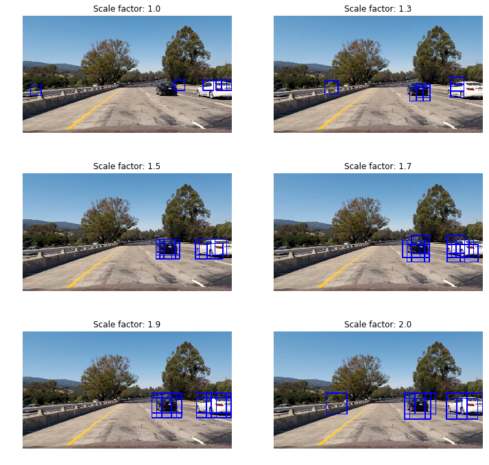

Since overlapping sliding windows are used (1 cell per step), the vehicle detection regtangles overlaps. In order to detect the actual location of a vehicle, a heat map is generated using these overlapping areas. Since with more overlaps the model becomes more confident about the location of a vehicle, the scale factor results with more detection overlaps will be used and that is 1.7 which can be seen in the test image above.

## Bounding Box Aggregation, False Positive Thresholding and Labelling

In order to get an avarage high-confidence result from multiple judgements, bounding box aggregation is implemented using the previously mentioned heat maps.

To generate the heat maps, a background image (having all values equal to zero) with the same size of the region of the interest is created. Then, whenever there is a detection, the pixel intensities for that detection area of the background image are increased by one. This way, the intensity values increased by the number of overlaps generating a heat map. Below an example of a heat map is given from a test image.

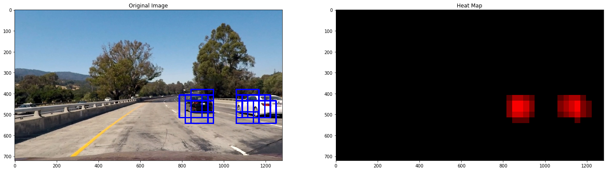

The bright colors on the heat map are where the most overlaps occur. In order to eliminate the false positives a thresholding is also applied (the chosen value for thresholding is 1) on the heat maps. This eliminates most of the false positives and helps with the reliability of the results. After the heat map implementation, the islands on heat maps are detected and labelled using the `label` function of [scipy](https://www.scipy.org/)'s [ndimage library](https://docs.scipy.org/doc/scipy-0.16.0/reference/generated/scipy.ndimage.measurements.label.html). A result of labelling for two cars are given in different colors below.

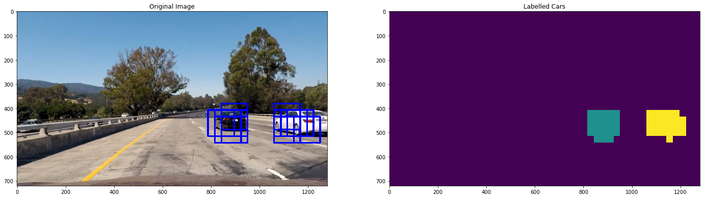

## Locating the Vehicles

After labelling the cars, the minimum and maximum x and y coordinates of the label boundaries are used to locate and draw rectangles around the cars. The results on the test images are given along with the heat maps below.

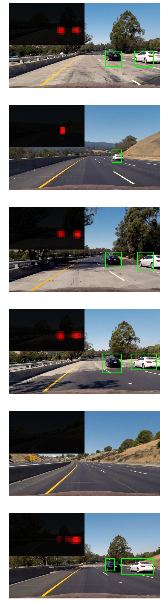

## Results on the Project Video and False Positive Mining

The car finding pipeline mentioned above is tested on the project video. The final model detects the cars reliably. However, borders of the detection rectangles change too rapidly in each frame. In order to overcome this situation, `groupRectangles` function of the [OpenCV](http://docs.opencv.org/2.4/modules/objdetect/doc/cascade_classification.html#grouprectangles) library is used to cluster and average the rectangles of similar size and similar locations in an array of consecutive results. This lets the detection borders become more consistent. And in addition, helps discard the appearing false positives in short time intervals. However, some false negative detections are still present as it is shown in the example below.

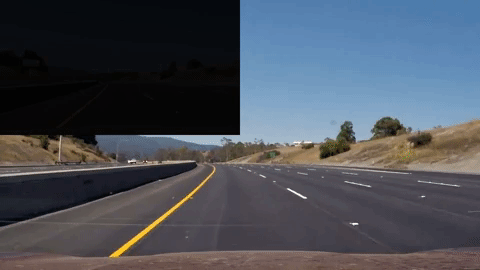

False positives appear mostly when there is a tree, traffic sign, shadow or an oncoming car. In order to overcome this problem, false positive mining is applied. On the left side of the video, where there is known to be no cars to detect, a region of interest selected to [run the model and collect](./mine-false-positive-data.ipynb) the detections which are known to be all false positives. An example for this region is given below.

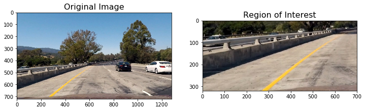

Then the collected  examples are resized to 64x64 pixels and [augmented](./augment-false-positives.ipynb) by randomly stretching, translating and rotating. Then all the examples are included to the non-vehicle class of the dataset and the model [trained again](./train-model-with-extra-augmented-best-dataset.ipynb). Below some of the mined false positives are given.

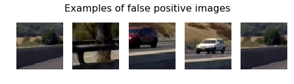

And some augmentation examples on the false positives are given below.

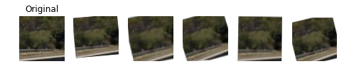

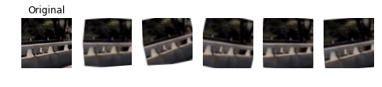

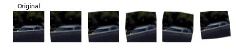

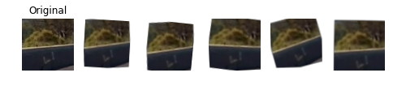

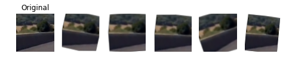

## Final Video

After false posivite mining, the same model trained with the final augmented dataset and used to detect the vehicles in the project video. For the left side of the video, false positive detection rate dropped considerably (e.g. the false positive detection at the beginning of the video is lost). To generate the final video, the final model used with the pipeline for detection. In addition, since the project videos are the same with the previous [advanged lane detection project](https://github.com/wphw/CarND-Advanced-Lane-Lines), both pipelines are used together to output the final video by detecting the lane and the vehicles together. For the full result please follow [this youtube link]().

## Discussions and Possible Improvements

Using Hog features, it is possible to reach very high accuracies. And since there are too many overlapping sliding windows to search an image for detection and localization problems, reducing the false positives by reaching low error rates becomes important. However, extracting HOG features is a computationally expensive process. In this project, despite computing the whole HOG features at once, a single scale overlapping sliding windows approach on a region of interest with 1280x380 pixels in size took about 20 minutes on an ASUS Intel Core i7 notebook for a 50 seconds video (about 1 iterations per second). Thus, this approach does not seem to offer a sufficient solution for real time applications.

In addition, exctracting true features for any specific datasets needs extra work and efford to get a reliable model (e.g. a model with less false positives). Thus, using convolutional neural networks can be a better choice, since these models extract their features by optimizing convolutional layers.

For These reasons, using the power of convolutional neural network models might be a better choice and help improve the results. There are various models which are known to be very fast (using the benefits of GPUs and parallel computing) and state of the art on localization tasks like [Fast R-CNN](https://arxiv.org/abs/1504.08083), [YOLO](https://arxiv.org/abs/1506.02640), [YOLO9000](./https://arxiv.org/abs/1612.08242), etc. Further implementations with these architectures may help implementing fast classifiers which is an important factor for real time self-driving car applications.